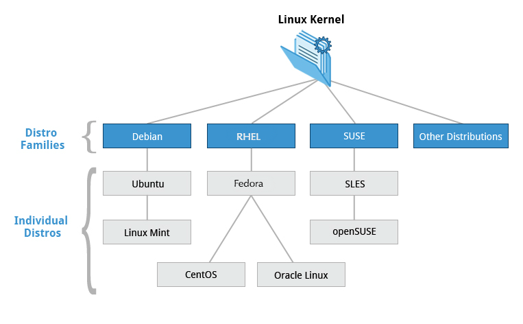
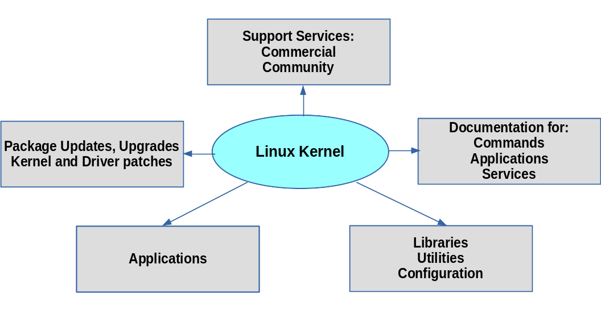
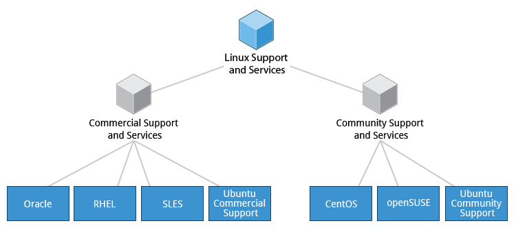

# Introdutcion to Linux -101

## Chapter 1

**Linux**

**Linux Foundation**: The Linux Foundation is the umbrella organization for many critical open source projects that power corporations, spanning all industry sectors. Its work today extends far beyond Linux, fostering innovation at every layer of the software stack.

Requirements: One Linux Distro Installed

Three families and represntative distribution:

1. Red Hat Family Systems (including CentOS and Fedora)
2. SUSE Family Systems (including openSUSE)
3. Debian Family Systems (including Ubuntu and Linux Mint).

### Red Hat Family

Some of the key facts about the Red Hat distribution family are:

- Fedora serves as an upstream testing platform for RHEL.
- CentOS is a close clone of RHEL, while Oracle Linux is mostly a copy with some changes.
- It supports hardware platforms such as Intel x86, Arm, Itanium, PowerPC, and IBM System z.
- It uses the yum and dnf RPM-based yum package managers (discussed more later) to install, update, and remove packages in the system.
- RHEL is widely used by enterprises which host their own systems.

### SUSE Family

Some of the key facts about the SUSE family are listed below:

- SUSE Linux Enterprise Server (SLES) is upstream for openSUSE.
- It uses the RPM-based zypper package manager (we cover it in detail later) to install, update, and remove packages in the system.
- It includes the YaST (Yet Another Setup Tool) application for system administration purposes.
- SLES is widely used in retail and many other sectors.

### Debian Family

Some key facts about the Debian family are listed below:

- The Debian family is upstream for Ubuntu, and Ubuntu is upstream for Linux Mint and others.
- It uses the DPKG-based APT package manager (using apt, apt-get, apt-cache, etc., which we cover in detail later) to install, update, and remove packages in the system.
- Ubuntu has been widely used for cloud deployments.
- While Ubuntu is built on top of Debian and is GNOME-based under the hood, it differs visually from the interface on standard Debian, as well as other distributions.

### Chapter Summary

There are three major distribution families within Linux: Red Hat, SUSE and Debian.

## Chapter 2: Linux Philosophy

Linux is an operating system and its core is just a kernel. It talks to the hardware makes the hardware work. It makes it able for you to run programs and do what you want to do.

### Linux Installation Methods

- Native Installation: To do this you will need a machine with enough useable disk space or will have to
  repartition to make space available.
- Virtual Machine Installation: To do this you’ll have to first install a hypervisor program as described later.
- Live CD/DVB/USB method: To do this no install is needed, but performance will be weaker.

**Linus Torvalds** was a student in Helsinki, Finland, in 1991, when he started a project: writing his own operating system kernel. He also collected together and/or developed the other essential ingredients required to construct an entire operating system with his kernel at the center. It wasn't long before this became known as the Linux kernel.

**Philosophy**
Linux borrows heavily from the well-established family of UNIX operating systems. It was written to be a free and open source alternative; at the time, UNIX was designed for computers much more powerful than PCs, and furthermore, it was quite expensive.

Files are stored in a hierarchical filesystem, with the top node of the system being the root or simply "/". Whenever possible, Linux makes its components available via files or objects that look like files. Processes, devices, and network sockets are all represented by file-like objects and can often be worked with using the same utilities used for regular files. Linux is a fully multitasking (i.e., multiple threads of execution are performed simultaneously), multiuser operating system with built-in networking and service processes known as daemons in the UNIX world.

NOTE: Linux was inspired by UNIX, but it is not UNIX.

**Linux Community**: https://courses.edx.org/videos/block-v1:LinuxFoundationX+LFS101x+1T2025+type@video+block@edadd87b8a5c4ab8a1e5764f2514450e

Below are some examples of open source products that you probably encounter on a daily basis:

1. Android: used in the majority of smartphones and other mobile devices worldwide, built on top of the Linux kernel.
2. Apache Web Server (httpd): about half of all web servers are running Apache and its related products.
3. Social Media: virtually all social media platforms (Facebook, Twitter, Instagram, etc.) use OSS components throughout.
4. Search Engines: Google and other search engines have vast data farms running Linux.
5. Weather Forecasting: essentially, 100% of the world’s supercomputers run Linux, and forecasting the weather is one of the most intensive uses.
6. Personal Fitness Devices: including FitBit.
7. DVRs: almost all set-top boxes and video recorders run Linux
8. Medical Devices: a large number of medical devices used routinely every day are running Embedded Linux.

\*All these projects make extensive use of OSS tooling, such as gcc, make, glibc, and languages such as Python, Perl, and Ruby.

### Important Linux Terminology and Examples

- **Kernel**: The kernel is considered the brain of the Linux operating system. It controls the hardware and makes the hardware interact with the applications. An example of a kernel is the Linux kernel. The most recent Linux kernel, along with past Linux kernels, can be found at the kernel.org web site.

- **distribution**: A distribution also known as Distros is a collection of programs combined with the Linux kernel to make up a Linux-based operating system. Some common examples of a distribution are Red Hat Enterprise Linux, Fedora, Ubuntu, and Gentoo.

- **boot loader**: a program that boots the operating system (Boot loader -> Linux Kernel -> init). Two examples of boot loaders are GRUB and ISOLINUX

- **service**: a program that runs as a background process. E.g httpd Web Server, ftpd FTP Server, named Name Server, dhcpd DHCP Server.

- **filesystem**: a method for storing and organizing files in Linux. E.g ext3, ext4, FAT, XFS, NTFS and Btrfs

- **X Window system**: provides standard toolkit and protocol to build graphical user interfaces on neraly all Linux system.

- **desktop environment**: Graphical user interface on top of the operating system. E.g GNOME, KDE, Xfce and Fluxbox are some examples of desktop environment.

- **command line**: An interface for typing commands on top of the operating system.

- **Shell**: A command line interpreter that interprets the command line input and instructs the OS to perform any necessary tasks and commands. E.g bash, tcsh, and zsh

### Chapter Summary

Let’s summarize the key concepts covered:

- Linux borrows heavily from the UNIX operating system, with which its creators were well-versed.
- Linux accesses many features and services through files and file-like objects.
- Linux is a fully multi-tasking, multi-user operating system, with built-in networking and service processes known as daemons.
- Linux is developed by a loose confederation of developers from all over the world, collaborating over the Internet, with Linus Torvalds at the head. Technical skill and a desire to contribute are the only qualifications for participating.
- The Linux community is a far reaching ecosystem of developers, vendors, and users that supports and advances the Linux operating system.
- Some of the common terms used in Linux are: kernel, distribution, boot loader, service, filesystem, X Window system, desktop environment, and command line.
- A full Linux distribution consists of the kernel plus a number of other software tools for file-related operations, user management, and software package management.

aa
