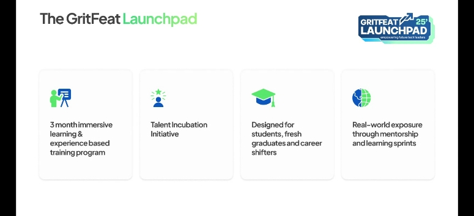

# Gritfeat Launchpad - DevOps Learning Journey 🚀

Welcome to my DevOps learning repository! This repository documents my journey and progress through the **Gritfeat Launchpad DevOps Program**.



## 📖 About

This repository contains my learning notes, projects, and hands-on practice materials as I advance through the DevOps curriculum at Gritfeat Launchpad. It serves as both a knowledge base and a portfolio of my growing expertise in DevOps technologies and practices.

## 🎯 Program Overview

**Gritfeat Launchpad** is a comprehensive DevOps training program that covers:

- Linux Fundamentals
- Version Control with Git
- Containerization (Docker)
- Container Orchestration (Kubernetes)
- Infrastructure as Code (Terraform, Ansible)
- CI/CD Pipelines
- Monitoring and Logging
- Cloud Platforms (AWS/Azure/GCP)
- Security Best Practices

## 📁 Repository Structure

```
├── LinuxFoundationX LFS101x/          # Linux Foundation Course Materials
│   ├── Intro_to_Linux.md             # Comprehensive Linux notes
│   └── images/
```

### 🔄 Currently Learning

- Linux Foundation LFS101x - Introduction to Linux

## 🔗 Resources & References

- [Linux Foundation](https://www.linuxfoundation.org/)
- [Gritfeat Launchpad](https://gritfeat.com/)
- [DevOps Roadmap](https://roadmap.sh/devops)
- [AWS Documentation](https://docs.aws.amazon.com/)
- [Kubernetes Documentation](https://kubernetes.io/docs/)

---

**"Learning never exhausts the mind."** - Leonardo da Vinci

_Last Updated: July 2025_
